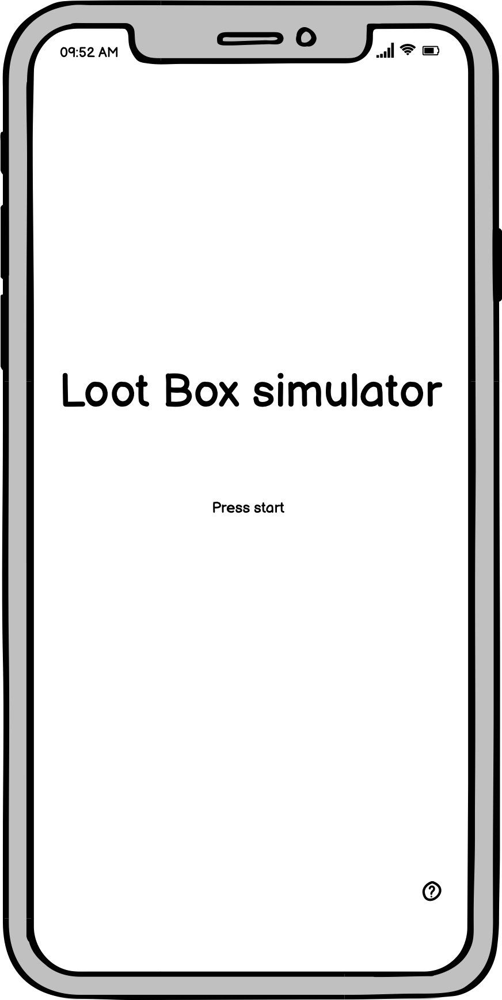
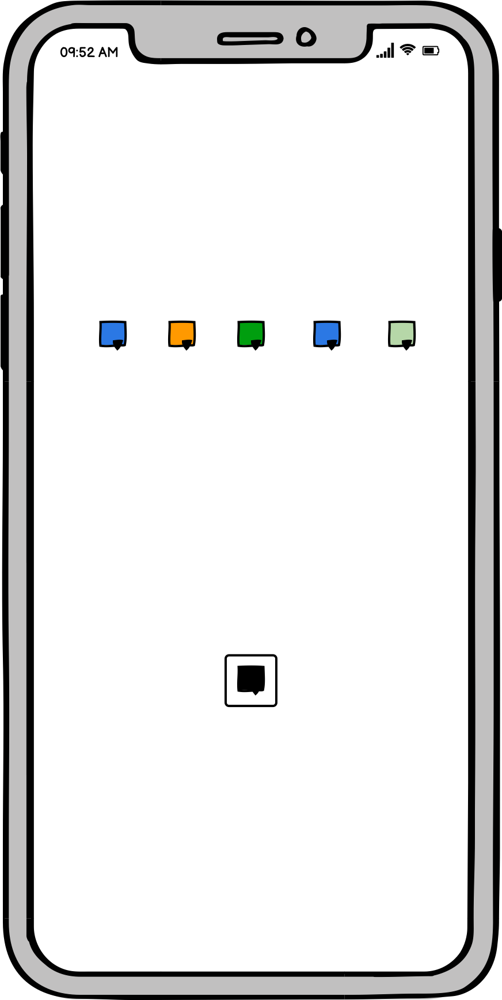

# LootBox Simulator

## Game Loop
* Open boxes to earn points. Combo matching loot to get bonuses. Use those points to open more powerful lootboxes. 

### Specifications
* React-Native

### User stories: 
* As a user, I want to be able to open loot boxes for points
* As a user, I want to be able to manipulate the game to increase my combos. 
* As I user, I want to accumiulate currency - based off my points
* As a user, I want to be able to spend that currency on better lootboxes. 

### Wireframe
#### Start Screen

#### Game Screen
